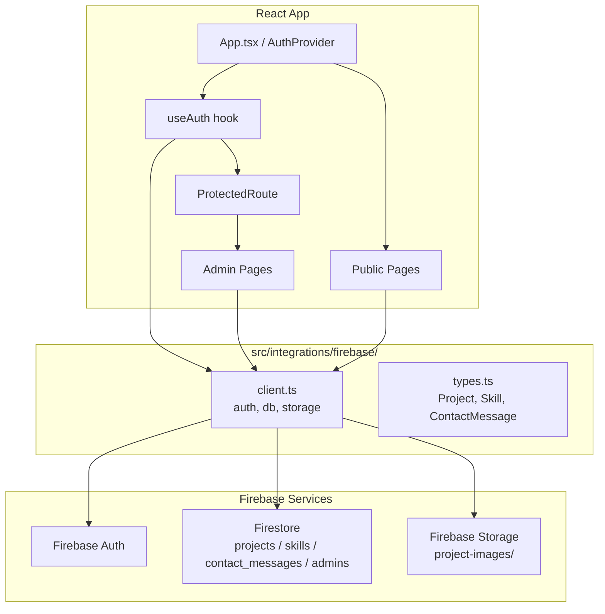
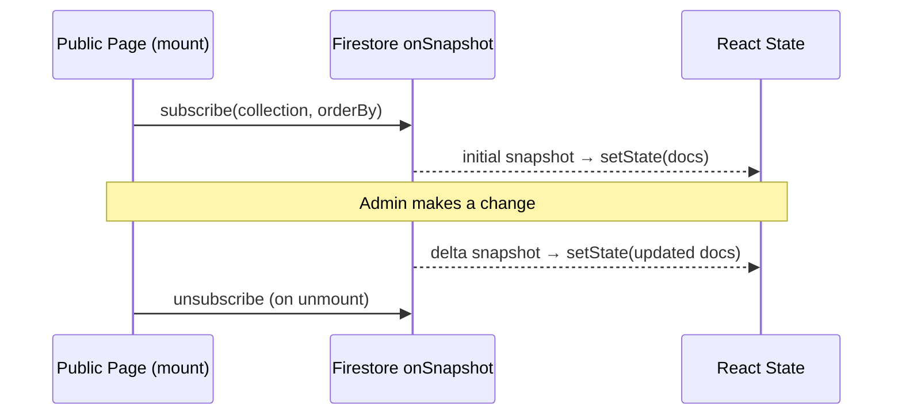
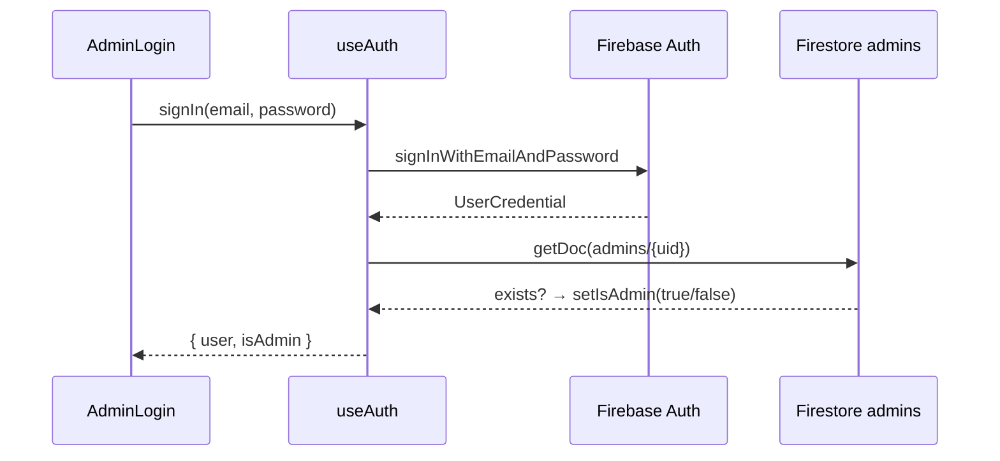

# Design Document: Supabase to Firebase Migration

## Overview

This migration replaces the Supabase backend (Auth, PostgreSQL, Storage) with Firebase (Auth, Firestore, Storage) across a React + TypeScript + Vite portfolio site. The public-facing pages (Home, Projects, Skills) and the admin panel (Dashboard, Projects, Skills, Messages) must continue to function identically after migration, with the added benefit of real-time Firestore `onSnapshot` listeners replacing one-time `getDocs` calls.

The migration is a pure backend swap — no UI redesign. The existing terminal/neon aesthetic, component structure, and routing remain unchanged. The key behavioral changes are:

- Auth: Supabase `signInWithPassword` → Firebase `signInWithEmailAndPassword`
- Admin check: Supabase RPC `has_role` → Firestore `admins` collection document lookup
- Data: Supabase PostgreSQL tables → Firestore collections (`projects`, `skills`, `contact_messages`)
- Storage: Supabase Storage bucket → Firebase Storage `project-images/` path
- Real-time: One-time `supabase.from(...).select()` → `onSnapshot` listeners on all data-reading pages

---

## Architecture



### Data Flow: Public Pages (Real-Time)



### Data Flow: Auth + Admin Check



---

## Components and Interfaces

### `src/integrations/firebase/client.ts`

Initializes the Firebase app once (guarded by `getApps().length`) and exports the three service singletons used throughout the app.

```typescript
import { initializeApp, getApps } from "firebase/app";
import { getAuth } from "firebase/auth";
import { getFirestore } from "firebase/firestore";
import { getStorage } from "firebase/storage";

// Validates all required env vars at module load time
const firebaseConfig = { ... };

const app = getApps().length ? getApps()[0] : initializeApp(firebaseConfig);

export const auth = getAuth(app);
export const db = getFirestore(app);
export const storage = getStorage(app);
```

### `src/integrations/firebase/types.ts`

Plain TypeScript interfaces matching the Firestore document shapes. No generated code — these are hand-authored to match the Firestore collections.

```typescript
export interface Project {
  id: string;
  name: string;
  description: string | null;
  status: "running" | "stopped" | "completed" | "pending";
  tech: string[];
  github_url: string | null;
  live_url: string | null;
  image_url: string | null;
  featured: boolean;
  display_order: number | null;
  created_at: string;
  updated_at: string;
}

export interface Skill {
  id: string;
  name: string;
  category: string;
  proficiency: number | null;
  icon: string | null;
  display_order: number | null;
  created_at: string;
}

export interface ContactMessage {
  id: string;
  name: string;
  email: string;
  subject: string | null;
  message: string;
  is_read: boolean;
  created_at: string;
}
```

### `src/hooks/useAuth.tsx`

Replaces Supabase auth with Firebase Auth. The public interface (`user`, `isAdmin`, `isLoading`, `signIn`, `signOut`, `signUp`) is preserved so all consumers compile without changes.

Key changes:
- `onAuthStateChanged` replaces `supabase.auth.onAuthStateChange`
- `User` type imported from `firebase/auth` instead of `@supabase/supabase-js`
- `session` field is removed (Firebase has no session object; callers that used `session` will use `user` instead)
- Admin check: `getDoc(doc(db, "admins", uid))` replaces `supabase.rpc("has_role", ...)`
- `signIn`: `signInWithEmailAndPassword(auth, email, password)`
- `signOut`: `signOut(auth)`
- `signUp`: `createUserWithEmailAndPassword(auth, email, password)`
- Password reset: `sendPasswordResetEmail(auth, email, { url: origin + "/reset-password" })`

```typescript
interface AuthContextType {
  user: FirebaseUser | null;
  isAdmin: boolean;
  isLoading: boolean;
  signIn: (email: string, password: string) => Promise<{ error: Error | null }>;
  signUp: (email: string, password: string) => Promise<{ error: Error | null }>;
  signOut: () => Promise<void>;
}
```

### `src/components/admin/ProtectedRoute.tsx`

No interface change. Continues to read `{ user, isAdmin, isLoading }` from `useAuth()`. The component body is unchanged — only the underlying hook implementation changes.

### Public Pages — `onSnapshot` Pattern

All public data-reading pages follow this pattern:

```typescript
useEffect(() => {
  const q = query(collection(db, "projects"), orderBy("display_order", "asc"));
  const unsub = onSnapshot(q, (snap) => {
    setProjects(snap.docs.map(d => ({ id: d.id, ...d.data() } as Project)));
    setLoading(false);
  }, (err) => {
    setError(err.message);
    setLoading(false);
  });
  return () => unsub();
}, []);
```

Pages using this pattern: `Projects.tsx`, `Skills.tsx`, `Home.tsx` (featured projects).

### Admin Pages — Firestore CRUD

Admin pages (`AdminProjects`, `AdminSkills`, `AdminMessages`, `AdminDashboard`) replace Supabase calls with Firestore equivalents:

| Supabase | Firestore |
|---|---|
| `.from("x").select("*")` | `getDocs(collection(db, "x"))` or `onSnapshot` |
| `.from("x").insert(payload)` | `addDoc(collection(db, "x"), { ...payload, created_at: serverTimestamp() })` |
| `.from("x").update(payload).eq("id", id)` | `updateDoc(doc(db, "x", id), { ...payload, updated_at: serverTimestamp() })` |
| `.from("x").delete().eq("id", id)` | `deleteDoc(doc(db, "x", id))` |
| `.select("id", { count: "exact", head: true })` | `getCountFromServer(collection(db, "x"))` |

`AdminMessages` and `AdminDashboard` use `onSnapshot` for real-time updates. `AdminProjects` and `AdminSkills` use `onSnapshot` for the list view and imperative writes for mutations.

### Firebase Storage — Image Upload

```typescript
import { ref, uploadBytes, getDownloadURL } from "firebase/storage";

const storageRef = ref(storage, `project-images/${Date.now()}-${sanitizedName}.${ext}`);
await uploadBytes(storageRef, file);
const url = await getDownloadURL(storageRef);
```

### `AdminLogin.tsx` — Password Reset

The inline `supabase.auth.resetPasswordForEmail` call is replaced with:

```typescript
import { sendPasswordResetEmail } from "firebase/auth";
await sendPasswordResetEmail(auth, email, { url: `${window.location.origin}/reset-password` });
```

---

## Data Models

### Firestore Collections

#### `projects`
```
{
  name: string,
  description: string | null,
  status: "running" | "stopped" | "completed" | "pending",
  tech: string[],
  github_url: string | null,
  live_url: string | null,
  image_url: string | null,
  featured: boolean,
  display_order: number | null,
  created_at: Timestamp,
  updated_at: Timestamp
}
```

#### `skills`
```
{
  name: string,
  category: "frontend" | "backend" | "database" | "tools",
  proficiency: number | null,   // 0–100
  icon: string | null,
  display_order: number | null,
  created_at: Timestamp
}
```

#### `contact_messages`
```
{
  name: string,
  email: string,
  subject: string | null,
  message: string,
  is_read: boolean,
  created_at: Timestamp
}
```

#### `admins`
```
// Document ID = Firebase Auth UID
// No required fields — existence of the document grants admin access
{ }
```

### Firestore Security Rules

```
rules_version = '2';
service cloud.firestore {
  match /databases/{database}/documents {

    function isAdmin() {
      return request.auth != null &&
             exists(/databases/$(database)/documents/admins/$(request.auth.uid));
    }

    // Projects: public read, admin write
    match /projects/{docId} {
      allow read: if true;
      allow create, update, delete: if isAdmin();
    }

    // Skills: public read, admin write
    match /skills/{docId} {
      allow read: if true;
      allow create, update, delete: if isAdmin();
    }

    // Contact messages: public create, admin read/update/delete
    match /contact_messages/{docId} {
      allow create: if true;
      allow read, update, delete: if isAdmin();
    }

    // Admins: admin only
    match /admins/{docId} {
      allow read, write: if isAdmin();
    }
  }
}
```

### Firebase Storage Rules

```
rules_version = '2';
service firebase.storage {
  match /b/{bucket}/o {
    match /project-images/{allPaths=**} {
      allow read: if true;
      allow write: if request.auth != null;
    }
  }
}
```

### Environment Variables

The following variables replace the Supabase env vars in `.env`:

```
VITE_FIREBASE_API_KEY=
VITE_FIREBASE_AUTH_DOMAIN=
VITE_FIREBASE_PROJECT_ID=
VITE_FIREBASE_STORAGE_BUCKET=
VITE_FIREBASE_MESSAGING_SENDER_ID=
VITE_FIREBASE_APP_ID=
```

---

## Correctness Properties

*A property is a characteristic or behavior that should hold true across all valid executions of a system — essentially, a formal statement about what the system should do. Properties serve as the bridge between human-readable specifications and machine-verifiable correctness guarantees.*

### Property 1: Contact message round-trip

*For any* valid contact form submission (non-empty name, email, subject, message), writing the document to Firestore and then reading it back SHALL return a document whose fields match the submitted values, with `is_read` equal to `false`.

**Validates: Requirements 7.1**

### Property 2: Admin check correctness

*For any* Firebase Auth UID, `isAdmin` SHALL be `true` if and only if a document with that UID exists in the `admins` Firestore collection.

**Validates: Requirements 3.2**

### Property 3: onSnapshot listener cleanup

*For any* component that subscribes to a Firestore `onSnapshot` listener on mount, the unsubscribe function returned by `onSnapshot` SHALL be called when the component unmounts, leaving no active listeners.

**Validates: Requirements 12.8**

### Property 4: Skills page derives data from Firestore

*For any* set of skill documents in Firestore, the Skills page SHALL render exactly those skills (no more, no fewer) and SHALL NOT render any skill whose name or proficiency comes from the hardcoded array previously defined in `src/pages/Skills.tsx`.

**Validates: Requirements 6.6, 6.7, 6.8**

### Property 5: Home page featured projects from Firestore

*For any* set of projects in Firestore, the Home page "Featured Projects" section SHALL display exactly the projects where `featured === true`, ordered by `display_order` ascending, and SHALL NOT display any project from the hardcoded `featuredProjects` array.

**Validates: Requirements 11.2, 11.3**

### Property 6: Image upload URL stored in Firestore

*For any* image file uploaded to Firebase Storage for a project, the `image_url` field stored in the corresponding Firestore `projects` document SHALL equal the public download URL returned by `getDownloadURL` for that file.

**Validates: Requirements 8.2**

---

## Error Handling

| Scenario | Behavior |
|---|---|
| Missing Firebase env var at startup | `client.ts` throws `Error: Missing Firebase config: VITE_FIREBASE_*` before app renders |
| `signInWithEmailAndPassword` fails | `useAuth.signIn` returns `{ error }`, `AdminLogin` displays the error message in the terminal output |
| `onSnapshot` listener error | Affected page sets `error` state and renders an error message; no stale data is shown silently |
| Firestore write fails (contact form) | `Contact.tsx` shows `[ERROR] Failed to send message` in terminal output and a `toast.error` |
| Image upload fails | `AdminProjects` shows `toast.error("Image upload failed: ...")` and retains the previous `image_url` |
| Admin check Firestore read fails | `useAuth` catches the error, sets `isAdmin = false`, and logs to console; user is treated as non-admin |
| `sendPasswordResetEmail` fails | `AdminLogin` shows `toast.error(error.message)` |

---

## Testing Strategy

This feature is a backend migration — the logic under test is primarily data transformation (mapping Firestore `DocumentSnapshot` to typed interfaces), auth state management, and listener lifecycle. PBT applies to the pure logic layer; integration tests cover the Firebase service interactions.

### Unit Tests (example-based)

- `client.ts`: throws when a required env var is missing
- `useAuth`: `isAdmin` is `false` after sign-out
- `useAuth`: `isAdmin` is `false` when `admins` doc does not exist
- `mapDocToProject` / `mapDocToSkill` / `mapDocToMessage`: correct field mapping from `DocumentSnapshot` data
- `AdminLogin`: password reset button calls `sendPasswordResetEmail` with correct args
- `ProtectedRoute`: redirects to `/admin` when `user` is null
- `ProtectedRoute`: renders children when `user` is set and `isAdmin` is true
- `ProtectedRoute`: renders loading indicator when `isLoading` is true

### Property-Based Tests

Using **fast-check** (already compatible with the Vitest setup in this project).

Each property test runs a minimum of **100 iterations**.

**Property 1 — Contact message round-trip**
Tag: `Feature: supabase-to-firebase-migration, Property 1: contact message round-trip`
Generate: random `{ name, email, subject, message }` objects with non-empty strings.
Assert: after `addDoc` + `getDoc`, returned data matches input and `is_read === false`.
Use Firestore emulator to avoid live writes.

**Property 2 — Admin check correctness**
Tag: `Feature: supabase-to-firebase-migration, Property 2: admin check correctness`
Generate: random UIDs (strings). For each, randomly decide whether to insert an `admins` doc.
Assert: `checkIsAdmin(uid)` returns `true` iff the doc was inserted.
Use Firestore emulator.

**Property 3 — onSnapshot listener cleanup**
Tag: `Feature: supabase-to-firebase-migration, Property 3: onSnapshot listener cleanup`
Generate: random mount/unmount sequences for components using `onSnapshot`.
Assert: after unmount, the mock `unsubscribe` function has been called exactly once.
Use a mock Firestore to avoid live connections.

**Property 4 — Skills page derives data from Firestore**
Tag: `Feature: supabase-to-firebase-migration, Property 4: skills page derives data from Firestore`
Generate: random arrays of `Skill` objects with varying names, categories, and proficiency values.
Assert: the rendered skill list matches the generated array exactly; no hardcoded skill names appear.
Use Firestore emulator + React Testing Library.

**Property 5 — Home page featured projects from Firestore**
Tag: `Feature: supabase-to-firebase-migration, Property 5: home page featured projects from Firestore`
Generate: random arrays of `Project` objects with random `featured` booleans and `display_order` values.
Assert: rendered featured project cards match `projects.filter(p => p.featured).sort(by display_order)` exactly.
Use Firestore emulator + React Testing Library.

**Property 6 — Image upload URL stored in Firestore**
Tag: `Feature: supabase-to-firebase-migration, Property 6: image upload URL stored in Firestore`
Generate: random file names and mock download URLs.
Assert: after `uploadImage()`, the `image_url` in the saved Firestore doc equals the mocked `getDownloadURL` return value.
Use mocked Firebase Storage.

### Integration Tests

- Full sign-in flow against Firebase Auth emulator: valid credentials → `user` set, `isAdmin` set
- Full sign-in flow: invalid credentials → `error` returned
- Firestore security rules: unauthenticated read of `projects` succeeds; unauthenticated write fails
- Firestore security rules: unauthenticated create of `contact_messages` succeeds; unauthenticated read fails
- Firebase Storage rules: authenticated upload to `project-images/` succeeds; unauthenticated upload fails

### Test Infrastructure

- **Firebase Local Emulator Suite** (`firebase emulators:start`) for Auth, Firestore, and Storage
- **fast-check** for property-based tests
- **@testing-library/react** for component-level tests
- **vitest** as the test runner (already configured)
